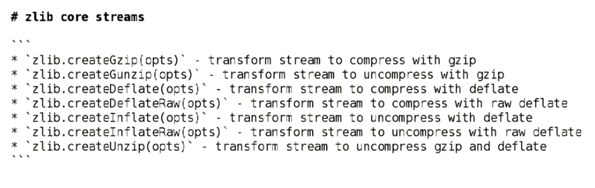

# Zlib

THESE ARE STREMAS THAT DEAL WITH COMPRESSION



## LETS FIRST PLAY AROUND WITH COMPRESSION IN COMMAND LINE

WE CREATED ORIGINAL FILE `_exercise/zlib/helloworld.txt`

WE WILL CREATE GZIPED VERSION OF MENTIONED FILE IN THE SAME FOLDER

```
gzip -<_exercise/zlib/helloworld.txt > _exercise/zlib/helloworld.txt.gz
```

**YOU CAN SEE CONYENTS OF COMPRESSED FILE WITH THIS:**

```
gunzip <_exercise/zlib/helloworld.txt.gz 
```

# LETS CREATE EXAMPLE IN NODEJS

`_exercise/foobarz.js`

```js
const {createReadStream, createWriteStream} = require("fs")
const {createGunzip, createGzip} = require("zlib")

// LETS CREATE READABLE STREAM FROM A FILE
const readable = createReadStream("_exercise/my_server.js")
// LETS DO SOME COMPRESSION
.pipe(createGzip())
// LETS WRITE THAT TO A NEW FILE
.pipe(createWriteStream("_exercise/zlib/my_server.js.gzip"))


// WHEN WRITING IS DONE LETS THROW CONTENT
// OF COMPRESSED FILE TO STANDARD OUTPUT

readable.once("finish", () => {
  // CREATE STREAM OF COMPRESED FILE
  createReadStream('_exercise/zlib/my_server.js.gzip')
    // LETS EXTRACT DATA FROM COMPRESSED FILE
    .pipe(createGunzip())
    // AND GIVE THAT TO TANDARD OUTPUT
    .pipe(process.stdout)
})
```

`node _exercise/foobarz.js`

WE CAN ALTER A BIT OUR EXAMPLE

WE CAN DEFINE HASHING OF CONTENTS OF ZIPPED FILE

WE WILL USE createHash FUNCTION

```js
const {createReadStream, createWriteStream} = require("fs")
const {createGunzip, createGzip} = require("zlib")
const {createHash} = require("crypto")

const readable = createReadStream("_exercise/my_server.js")
  .pipe(createGzip())
  .pipe(createWriteStream("_exercise/zlib/my_server.js.gzip"))


readable.once("finish", () => {
  createReadStream('_exercise/zlib/my_server.js.gzip')
    .pipe(createGunzip())
    // HASHING CHUNK
    .pipe(createHash("sha256", {encoding: "hex"}))
    // PIPING CHUNK TO STANDARD OUTPUT
    .pipe(process.stdout)
})
```
